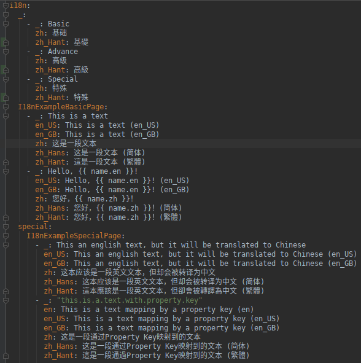
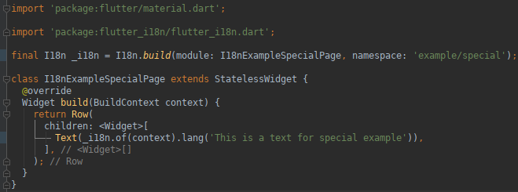
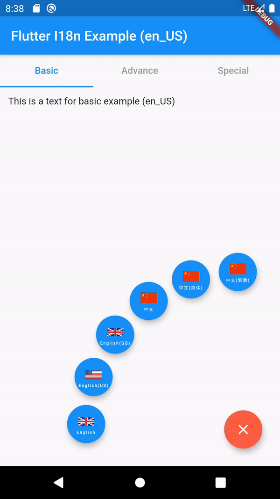

Flutter I18n Plugin
==================================================

A simple and powerful Flutter i18n plugin.

> Let's say **Bye Bye** to the **Property Key**.
>
> 让我们和**Property Key**说再见！
>
> 讓我們和**Property Key**說再見！

## Features

- Simple, cleaning and powerful API calls.
- No property keys are needed, just only use the **literal text** as usual,
  it will be translated to the locale language, e.g. `i18n.lang('This is a text')`.
- Be compatible with the way to use property key actually.
- Use YAML as the i18n message resource file instead of JSON or properties file.
- Use `namespace` and `module` to distinguish the i18n messages which are
  in the different modules.
- The same content of a i18n message can be converted to a different translation
  with a `annotation`.
- Use [reflected_mustache](https://github.com/MikeMitterer/reflected_mustache)
  as the i18n message template engine, so the i18n message can be controlled freely.
- Support to load the remote i18n message resources.
- Support to be used in the Flutter libraries.
- Dynamic change language when needed, e.g.
  `i18n.lang('This an english text, but it will be translated to Chinese', locale: 'zh_Hans')`.
- Support to custom the way to load or parse the i18n message resources.
- Enable debug mode which means disabling caches and showing errors.

## Demo

- [flutter_i18n_example](./example/)

| Messages + Code | Demo |
| :--- | :---: |
|     |  |

<!--
[Making animated GIFs of Flutter apps](https://github.com/flutter/flutter/wiki/Making-animated-GIFs-of-Flutter-apps):
- Launch app in release mode: `flutter run --release`
- Record video: `adb shell screenrecord /sdcard/recording.mp4`
- Interact with app. Terminate the recording with `CTRL+c`
- Pull the recording to local: `adb pull /sdcard/recording.mp4 .`
- Go to http://ezgif.com/video-to-gif and convert the recording to GIF
-->

## Docs

- [Getting Started](./docs/getting-started.md): Quick import the Flutter I18n Plugin to your app.
- [Usage Cases](./docs/cases.md): Check the cases to show how to use the Flutter I18n Plugin.
- [API Document](./docs/api.md): Guide to use the API of the Flutter I18n Plugin.

## License

[Apache License 2.0](https://www.apache.org/licenses/LICENSE-2.0)

## Thanks

- [aissat/easy_localization](https://github.com/aissat/easy_localization)

## Reference

- [Internation­alizing Flutter apps](https://flutter.dev/docs/development/accessibility-and-localization/internationalization)
- [Flutter Localization the Easy Way – Internationalization with JSON](https://resocoder.com/2019/06/01/flutter-localization-the-easy-way-internationalization-with-json/)
- [Flutter — Localization: step by step](https://proandroiddev.com/flutter-localization-step-by-step-30f95d06018d)
- [Managing Locale in Flutter](https://medium.com/saugo360/managing-locale-in-flutter-7693a9d4d6ac)
