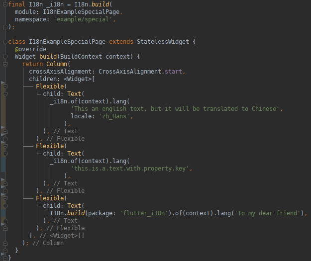
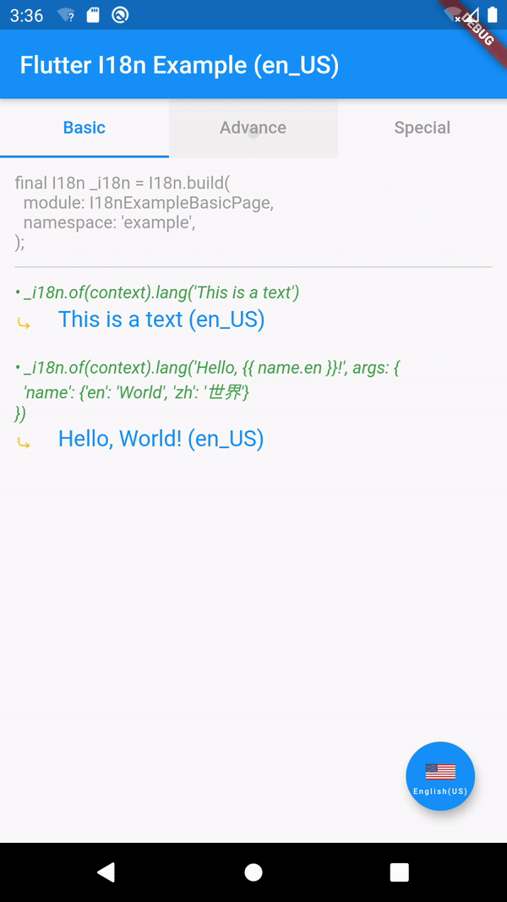

Flutter I18n Plugin
==================================================

A simple and powerful Flutter i18n plugin.

> Let's say **Bye Bye** to the **Property Key**.
>
> 让我们和**Property Key**说再见！
>
> 讓我們和**Property Key**說再見！

## Features

- Simple, cleaning and powerful API calls.
- Use **literal text** as the i18n message key instead of using property key like `this_is_a_text`
  or `this.is.a_text`. e.g. the `This is a text` in `i18n.lang('This is a text')` is
  a i18n message key and is also the default i18n message content.
- Use YAML as the message resource file instead of JSON or Properties file.
- Use `namespace` and `module` to distinguish the i18n messages which are in
  the different packages and modules.
- The same content of a i18n message can be translated to different content
  for the same another language via specifying a different `annotation`.
- Be compatible with the way to use property key actually.
- [**WIP**] Use [mustache](https://mustache.github.io) as the i18n message template engine,
  so the i18n message can be controlled freely.
- [**WIP**] Support to be used in the Flutter libraries.
- [**WIP**] Support to load the remote i18n message resources.
- [**WIP**] Dynamic change language when needed, e.g.
  `i18n.lang('This an english text, but it will be translated to Chinese', lang: 'zh_Hans')`.

## Have a Glance

<!-- 放上代码截图与本地化效果截图 -->

## Getting Started

- Add dependency to your `pubspec.yaml`:

```yaml
dependencies:
  flutter_i18n:
    git:
      url: git://github.com/flytreeleft/flutter_i18n.git
      ref: master
```

- Import `flutter_i18n` and create an inner global `I18n` instance in your widget dart file:

```dart
import 'package:flutter_i18n/flutter_i18n.dart';

// Create the i18n for the default module which is in the default package.
final I18n _i18n = I18n.build();
```

- Use `_i18n` anywhere you can get `BuildContext` directly or indirectly:

```dart
// ...
  @override
  Widget build(BuildContext context) {
    final title = _i18n.of(context).lang('Flutter I18n Example');

    return /*...*/;
  }
// ...
```

Actually, that's all you need to have to do. That means there is no need to define or
specify the i18n message resources. Your app will work well and it will show the text
which is used as the first parameter of `i18n.lang(...)`.

If you want to support another language for facing other country's people.
Just put your i18n message resource files into the directory `assets/i18n/`
(which is called the `basePath` to load i18n resource files) in your app project
and declare the i18n message [assets](https://flutter.dev/docs/development/ui/assets-and-images)
in your `pubspec.yaml`:

```yaml
# ...
flutter:
  # ...
  assets:
    - assets/i18n/default.yaml
    - assets/i18n/page.yaml
    # Or just specify the i18n directory (needs to end with `/`)
    #- assets/i18n/
```

Then, initialize the localization delegate for `I18n` in the root widget `MaterialApp`:

```dart
import 'package:flutter_localizations/flutter_localizations.dart';

// ...
  @override
  Widget build(BuildContext context) {
    return MaterialApp(
      locale: const Locale('en'),
      supportedLocales: [
        // https://en.wikipedia.org/wiki/Language_localisation#Language_tags_and_codes
        const Locale('en'),
        const Locale.fromSubtags(languageCode: 'zh'),
        const Locale.fromSubtags(languageCode: 'zh', scriptCode: 'Hant'),
      ],
      localizationsDelegates: [
        I18n.delegate(),
        GlobalMaterialLocalizations.delegate,
        GlobalWidgetsLocalizations.delegate,
      ],
      home: HomePage(),
    );
  }
// ...
```

The default i18n message resource file should be named as `default.yaml`,
and define i18n message as following:

```yaml
i18n:
  # The underline means the default module or default locale code
  _:
    - _: Flutter I18n Example
      en_US: Flutter I18n Example (US)
      en_GB: Flutter I18n Example (GB)
      zh: Flutter I18n功能演示
      zh_Hans: Flutter I18n功能演示 (中文简体)
      zh_Hant: Flutter I18n功能演示 (中文繁體)
```

And if you want to organize your i18n message resources in different directories or files,
just create some subdirectories or another YAML files in the `basePath`.

For example, if you created a YAML file `${basePath}/page/home.yaml`, and its content is:

```yaml
i18n:
  HomePage:
    - _: Change Language
      zh: 切换语言
    - _: This is a text
      zh: 这是一段文本
```

And you just need to specify the `namespace` and `module` name when creating the `I18n` instance:

```dart
// Note: 'HomePage' is a widget class name.
final I18n _i18n = I18n.build(module: HomePage, namespace: 'page/home');
```

**Note**:
- The parameter `module` can be a `String` or a class name.
- A full `namespace` should contain the subdirectory path and the resource file name,
  if the resource file is named as `default.yaml`, the `namespace` should not contain
  the resource file name any more.

## APIs

### `_I18nDelegate I18n.delegate({String basePath, String manifestPath})`

Create `LocalizationsDelegate` for the application.

- `basePath`: [String] The base directory to put the i18n message resource files.
  If you want to load resources from locale, the `basePath` should be
  the root of the i18n message [assets](https://flutter.dev/docs/development/ui/assets-and-images),
  if your i18n message resource files are put in a remote host,
  just set `basePath` as the URL location. Default is `assets/i18n`.
- `manifestPath`: [String] The filepath of manifest which specifies all of
  the i18n message resource paths. Default is `AssetManifest.json`.
  For the remote resources, the manifest's content should be an array json string
  which contains resource filepath.

**Note**:
- `I18nDelegate` is a inner class, you cannot and no need to use it directly.

### `I18n I18n.build({String package, String namespace, dynamic module})`

Create a `I18n` instance to load and translate the messages which are defined in
`${basePath}/${namespace}/default.yaml` or `${basePath}/${namespace}.yaml` for the `module`.

- `package`: [String] The package name of a Flutter library. If you want to use `flutter_i18n`
  in your Flutter library project, you need to specify the `package` as your library name.
  **Note**: if your library is in debug, the `I18n` will load the i18n messages from the `basePath`,
  if your library is imported by other project, it will load i18n messages from
  `packages/<library_name>/${basePath}`.
- `namespace`: [String] The YAML filepath where the i18n messages are defined in.
  Default is `default` which means the i18n messages are defined in the `${basePath}/default.yaml`.
- `module`: [String] A module name or a class name to distinguish the i18n messages
  between the different widgets. Default is `_` (a underline which represents the default module).

For example, if you want to use `I18n` in the widget `Calculator` for the library
[flutter_calculator](https://github.com/flytreeleft/flutter_calculator)
and define its i18n messages in `assets/i18n/main/calculator.yaml`, you need to create `I18n` like:

```dart
final I18n _i18n = I18n.build(
  package: 'flutter_calculator',
  module: Calculator,
  namespace: 'main/calculator',
);
```

### `String I18n#of(BuildContext context)#lang(String text, {dynamic args, String annotation, lang})`

Load `I18n` instance from `BuildContext` and translate the `text`:

```dart
String msg = _i18n.of(context).lang('This is a text');
```

- `text`: [String] The i18n message content, if no specified translated message, `#lang(...)`
  will return the `text` self.
- `args`: [List|Map|Object] The data which will be injected to the message template
  (using [mustache](https://mustache.github.io)).
- `lang`: [String|Locale] The language which the text will be translated to. If not specified this,
  the `text` will be translated to the app's locale language.

## Examples

- [flutter_i18n_example](./example/)

| Messages | Code | Demo |
| :--- | :---- | :---: |
|  |  |  |

<!--
[Making animated GIFs of Flutter apps](https://github.com/flutter/flutter/wiki/Making-animated-GIFs-of-Flutter-apps):
- Launch app in release mode: `flutter run --release`
- Record video: `adb shell screenrecord /sdcard/recording.mp4`
- Interact with app. Terminate the recording with `CTRL+c`
- Pull the recording to local: `adb pull /sdcard/recording.mp4 .`
- Go to http://ezgif.com/video-to-gif and convert the recording to GIF
-->

## License

[Apache License 2.0](https://www.apache.org/licenses/LICENSE-2.0)

## Thanks

- [aissat/easy_localization](https://github.com/aissat/easy_localization)

## Reference

- [Internation­alizing Flutter apps](https://flutter.dev/docs/development/accessibility-and-localization/internationalization)
- [Flutter Localization the Easy Way – Internationalization with JSON](https://resocoder.com/2019/06/01/flutter-localization-the-easy-way-internationalization-with-json/)
- [Flutter — Localization: step by step](https://proandroiddev.com/flutter-localization-step-by-step-30f95d06018d)
- [Managing Locale in Flutter](https://medium.com/saugo360/managing-locale-in-flutter-7693a9d4d6ac)
